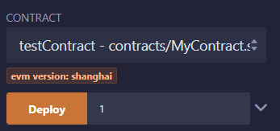

# Solidity 컨트랙트 작성 및 배포 가이드 (Remix 사용)

이 문서는 Remix IDE를 사용하여 Solidity로 스마트 컨트랙트를 작성하고 이더리움 네트워크에 배포하는 과정을 안내합니다.

## 준비사항

- Remix IDE에 접속: [https://remix.ethereum.org](https://remix.ethereum.org)

## 1. 스마트 컨트랙트 작성

### 1.1. Remix IDE 접속 및 파일 생성

1. Remix IDE에 접속합니다.
2. 좌측 파일 탐색기에서 `contracts` 폴더를 선택한 후, `New File` 버튼을 클릭하여 `MyContract.sol` 파일을 생성합니다.

### 1.2. MyContract.sol 작성

`MyContract.sol` 파일에 다음 코드를 작성합니다:

// SPDX-License-Identifier: MIT

pragma solidity ^0.8.18;

contract testContract {

    uint256 value;

    constructor (uint256 _p) {
        value = _p;
    }

    function setP(uint256 _n) payable public {
        value = _n;
    }

    function setNP(uint256 _n) public {
        value = _n;
    }

    function get () view public returns (uint256) {
        return value;
    }
}

## 2. 컴파일 하기 

컨트랙트가 에디터의 활성 탭으로 있는 상태에서 컴파일을 진행합니다.
컴파일을 빠르게 진행하는 방법은 Ctrl + S 키를 누르는 것입니다.

또한 좌측 메뉴의 Solidity 컴파일러로 이동하여 컴파일 버튼을 클릭하거나, 파일 탐색기에서 파일을 오른쪽 클릭하거나,
에디터 상단의 재생 버튼을 클릭하여 컴파일할 수 있습니다.

## 3. 배포 하기 

### 3.1. 환경 설정하기 

 좌측 메뉴에서 Deploy & Run Transactions를 선택합니다.
 Environment를 Remix VM(Shanghai)로 설정합니다. 
 아래 메뉴의 Account를 통해 Remix VM에 속해있는 지갑들과 각 지갑이 들고 있는 ether의 수를 확인할 수 있습니다. 

### 3.2. 컨트랙트 배포하기

위와 같이 contract가 잘 선택되어 있는지 확인하고, uint256 _p 값에 숫자 1을 입력하고 Deploy 버튼을 누릅니다. 

